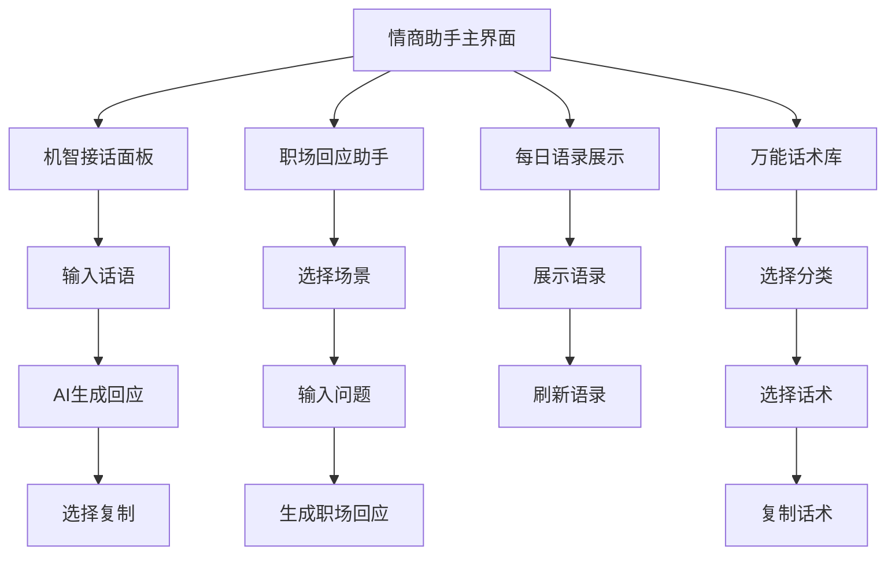

# 情商+幽默回应助手 - 产品需求文档

## 1. 产品概述

在现有的Vibe Coder AI Companion控制台中新增"情商+幽默回应助手"模块，帮助用户在日常聊天、职场交流、轻松社交等场景中快速获得既机智又带幽默感的高情商回答，提升互动氛围和社交体验。

该模块旨在缓解用户的社交焦虑，避免尴尬场面，让用户在各种交流场景中都能展现出幽默感和高情商，同时增加vibe控制台的趣味性和实用性。

## 2. 核心功能

### 2.1 用户角色

本模块不需要特殊的用户角色区分，所有用户均可使用全部功能。

### 2.2 功能模块

我们的情商+幽默回应助手包含以下主要功能页面：

1. **机智接话面板**：智能生成高情商幽默回应建议
2. **职场回应助手**：专门针对职场场景的委婉幽默应答
3. **每日语录展示**：自动推送机智语录
4. **万能话术库**：分类话术快速选择和使用

### 2.3 页面详情

| 页面名称 | 模块名称 | 功能描述 |
|----------|----------|----------|
| 机智接话面板 | 输入框 | 用户输入可能尴尬/刁钻/普通的话语 |
| 机智接话面板 | 回应生成器 | 基于AI生成2-3个高情商+幽默的回应建议 |
| 机智接话面板 | 回应展示区 | 展示生成的回应选项，支持一键复制 |
| 职场回应助手 | 场景选择器 | 选择职场常见场景类型 |
| 职场回应助手 | 问题输入 | 输入职场黑话或难题 |
| 职场回应助手 | 委婉回应生成 | 生成既委婉又幽默的职场应答方式 |
| 每日语录展示 | 语录卡片 | 展示每日推送的高情商幽默语录 |
| 每日语录展示 | 刷新按钮 | 手动获取新的语录内容 |
| 万能话术库 | 分类标签 | 赞美型、打圆场、自黑型等分类 |
| 万能话术库 | 话术列表 | 展示各分类下的预设话术 |
| 万能话术库 | 快速插入 | 点击话术直接复制到剪贴板 |

## 3. 核心流程

**主要用户操作流程：**

1. **机智接话流程**：用户在输入框中输入需要回应的话语 → 点击生成按钮 → AI分析并生成2-3个高情商幽默回应 → 用户选择合适的回应并复制使用

2. **职场回应流程**：用户选择职场场景类型 → 输入具体的职场问题或黑话 → 系统生成委婉幽默的应答建议 → 用户选择并使用

3. **每日语录流程**：用户打开模块 → 自动展示当日语录 → 可手动刷新获取新语录 → 复制分享语录内容

4. **话术库流程**：用户选择话术分类 → 浏览该分类下的话术选项 → 点击选中的话术 → 自动复制到剪贴板

## 4. 用户界面设计

### 4.1 设计风格

- **主色调**：延续现有vibe控制台的深色主题，主色为#1f2937（深灰），辅助色为#3b82f6（蓝色）和#10b981（绿色）
- **按钮样式**：圆角按钮设计，支持悬停效果和点击反馈
- **字体**：使用系统默认字体，标题16px，正文14px，小字12px
- **布局风格**：卡片式布局，顶部标签导航，响应式设计
- **图标风格**：使用简洁的线性图标，支持emoji表情增加趣味性

### 4.2 页面设计概览

| 页面名称 | 模块名称 | UI元素 |
|----------|----------|--------|
| 机智接话面板 | 输入区域 | 深色背景输入框，占位符文字，字符计数器 |
| 机智接话面板 | 生成按钮 | 蓝色渐变按钮，loading状态动画 |
| 机智接话面板 | 回应卡片 | 白色文字卡片，复制按钮，点赞功能 |
| 职场回应助手 | 场景选择 | 标签式选择器，高亮当前选中项 |
| 职场回应助手 | 结果展示 | 分条展示回应，编号标识，复制按钮 |
| 每日语录展示 | 语录卡片 | 居中展示，引号装饰，分享按钮 |
| 万能话术库 | 分类导航 | 水平滚动标签，激活状态高亮 |
| 万能话术库 | 话术网格 | 网格布局，悬停效果，点击复制提示 |

### 4.3 响应式设计

该模块采用移动端优先的响应式设计，在桌面端以侧边栏形式集成到现有控制台中，在移动端可独立使用。支持触摸交互优化，确保在各种设备上都有良好的用户体验。