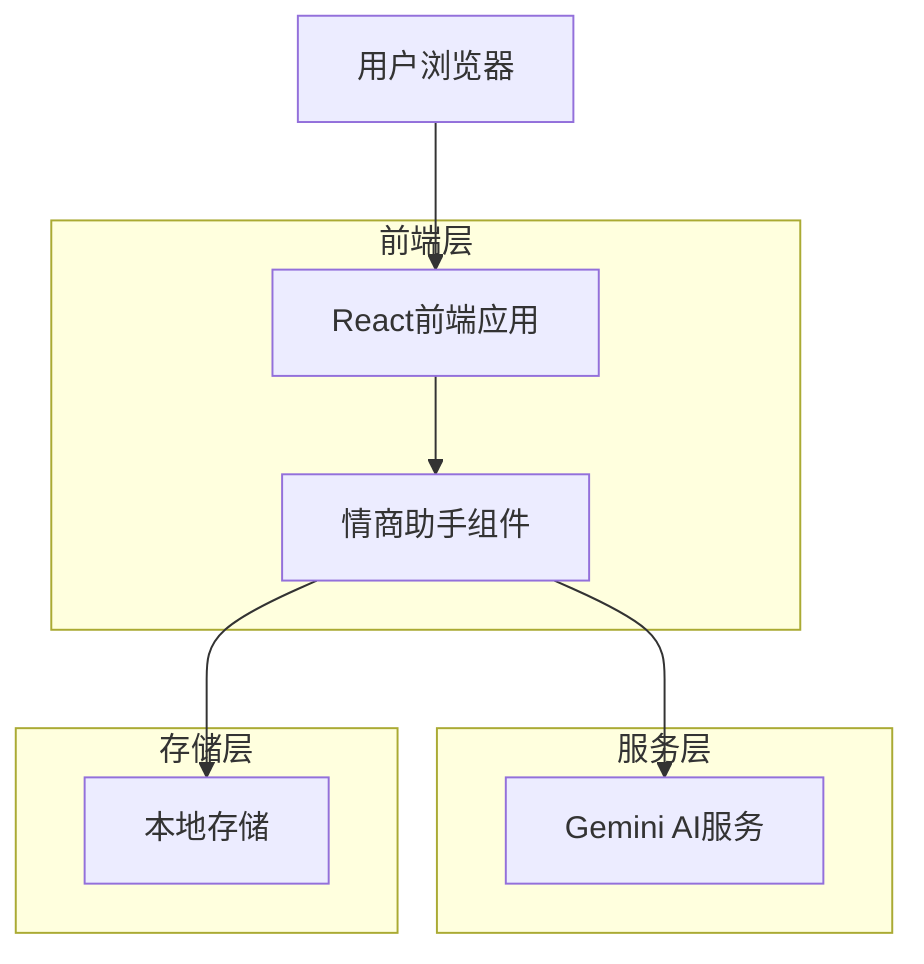
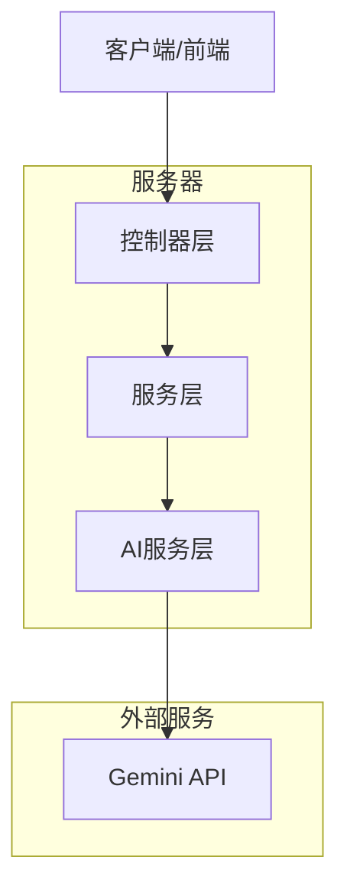
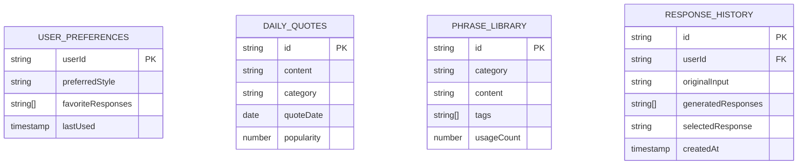

# 情商+幽默回应助手 - 技术架构文档

## 1. 架构设计



## 2. 技术描述

* 前端：React\@18 + TypeScript + Tailwind CSS\@3 + Vite

* AI服务：Google Gemini API (通过现有的geminiService.ts)

* 存储：LocalStorage (用于缓存每日语录和用户偏好)

## 3. 路由定义

| 路由                              | 用途                     |
| ------------------------------- | ---------------------- |
| /humor-assistant                | 情商助手主界面，集成在现有控制台的新标签页中 |
| /humor-assistant/smart-reply    | 机智接话功能面板               |
| /humor-assistant/workplace      | 职场回应助手面板               |
| /humor-assistant/daily-quote    | 每日语录展示面板               |
| /humor-assistant/phrase-library | 万能话术库面板                |

## 4. API定义

### 4.1 核心API

**机智回应生成**

```
POST /api/humor/smart-reply
```

请求参数：

| 参数名称    | 参数类型   | 是否必需  | 描述                                     |
| ------- | ------ | ----- | -------------------------------------- |
| input   | string | true  | 用户输入的原始话语                              |
| context | string | false | 对话上下文或场景描述                             |
| style   | string | false | 回应风格：'humorous', 'witty', 'diplomatic' |

响应参数：

| 参数名称       | 参数类型      | 描述          |
| ---------- | --------- | ----------- |
| success    | boolean   | 请求是否成功      |
| responses  | string\[] | 生成的2-3个回应建议 |
| confidence | number    | AI生成的置信度分数  |

请求示例：

```json
{
  "input": "你怎么又迟到了？",
  "context": "日常对话",
  "style": "humorous"
}
```

响应示例：

```json
{
  "success": true,
  "responses": [
    "我这是帮大家测试一下耐心值~",
    "地球转得太快了，我没跟上。",
    "放心，我迟到但绝对不会掉队。"
  ],
  "confidence": 0.85
}
```

**职场回应生成**

```
POST /api/humor/workplace-reply
```

请求参数：

| 参数名称     | 参数类型   | 是否必需  | 描述                                                |
| -------- | ------ | ----- | ------------------------------------------------- |
| input    | string | true  | 职场问题或黑话                                           |
| scenario | string | true  | 职场场景：'meeting', 'deadline', 'feedback', 'request' |
| tone     | string | false | 回应语调：'diplomatic', 'humorous', 'professional'     |

**每日语录获取**

```
GET /api/humor/daily-quote
```

响应参数：

| 参数名称     | 参数类型   | 描述     |
| -------- | ------ | ------ |
| quote    | string | 每日语录内容 |
| category | string | 语录分类   |
| date     | string | 生成日期   |

## 5. 服务器架构图



## 6. 数据模型

### 6.1 数据模型定义



### 6.2 数据定义语言

**用户偏好表 (user\_preferences)**

```sql
-- 创建表
CREATE TABLE user_preferences (
    user_id VARCHAR(255) PRIMARY KEY,
    preferred_style VARCHAR(50) DEFAULT 'humorous',
    favorite_responses TEXT[], -- 存储为JSON数组
    last_used TIMESTAMP WITH TIME ZONE DEFAULT NOW(),
    created_at TIMESTAMP WITH TIME ZONE DEFAULT NOW()
);

-- 创建索引
CREATE INDEX idx_user_preferences_last_used ON user_preferences(last_used DESC);
```

**每日语录表 (daily\_quotes)**

```sql
-- 创建表
CREATE TABLE daily_quotes (
    id UUID PRIMARY KEY DEFAULT gen_random_uuid(),
    content TEXT NOT NULL,
    category VARCHAR(50) NOT NULL,
    quote_date DATE NOT NULL,
    popularity INTEGER DEFAULT 0,
    created_at TIMESTAMP WITH TIME ZONE DEFAULT NOW()
);

-- 创建索引
CREATE INDEX idx_daily_quotes_date ON daily_quotes(quote_date DESC);
CREATE INDEX idx_daily_quotes_category ON daily_quotes(category);

-- 初始化数据
INSERT INTO daily_quotes (content, category, quote_date) VALUES
('努力不一定成功，但摸鱼一定快乐。', 'workplace', CURRENT_DATE),
('沟通的秘诀就是：把"你不懂"换成"我再解释下"。', 'communication', CURRENT_DATE),
('代码写得好不好，主要看注释够不够幽默。', 'programming', CURRENT_DATE);
```

**话术库表 (phrase\_library)**

```sql
-- 创建表
CREATE TABLE phrase_library (
    id UUID PRIMARY KEY DEFAULT gen_random_uuid(),
    category VARCHAR(50) NOT NULL,
    content TEXT NOT NULL,
    tags TEXT[], -- 存储为JSON数组
    usage_count INTEGER DEFAULT 0,
    created_at TIMESTAMP WITH TIME ZONE DEFAULT NOW()
);

-- 创建索引
CREATE INDEX idx_phrase_library_category ON phrase_library(category);
CREATE INDEX idx_phrase_library_usage ON phrase_library(usage_count DESC);

-- 初始化数据
INSERT INTO phrase_library (category, content, tags) VALUES
('赞美型', '你说得比KPI还动听。', '["职场", "赞美"]'),
('打圆场', '哈哈，这话题我们下次喝茶时再聊。', '["社交", "转移话题"]'),
('自黑型', '别说了，我的bug比你的发量还多。', '["程序员", "自嘲"]'),
('赞美型', '您这想法，比我的代码还优雅。', '["技术", "赞美"]'),
('打圆场', '这个问题很有深度，值得我们深入探讨。', '["会议", "缓解"]');
```

**回应历史表 (response\_history)**

```sql
-- 创建表
CREATE TABLE response_history (
    id UUID PRIMARY KEY DEFAULT gen_random_uuid(),
    user_id VARCHAR(255),
    original_input TEXT NOT NULL,
    generated_responses TEXT[], -- 存储为JSON数组
    selected_response TEXT,
    created_at TIMESTAMP WITH TIME ZONE DEFAULT NOW()
);

-- 创建索引
CREATE INDEX idx_response_history_user_id ON response_history(user_id);
CREATE INDEX idx_response_history_created_at ON response_history(created_at DESC);
```

