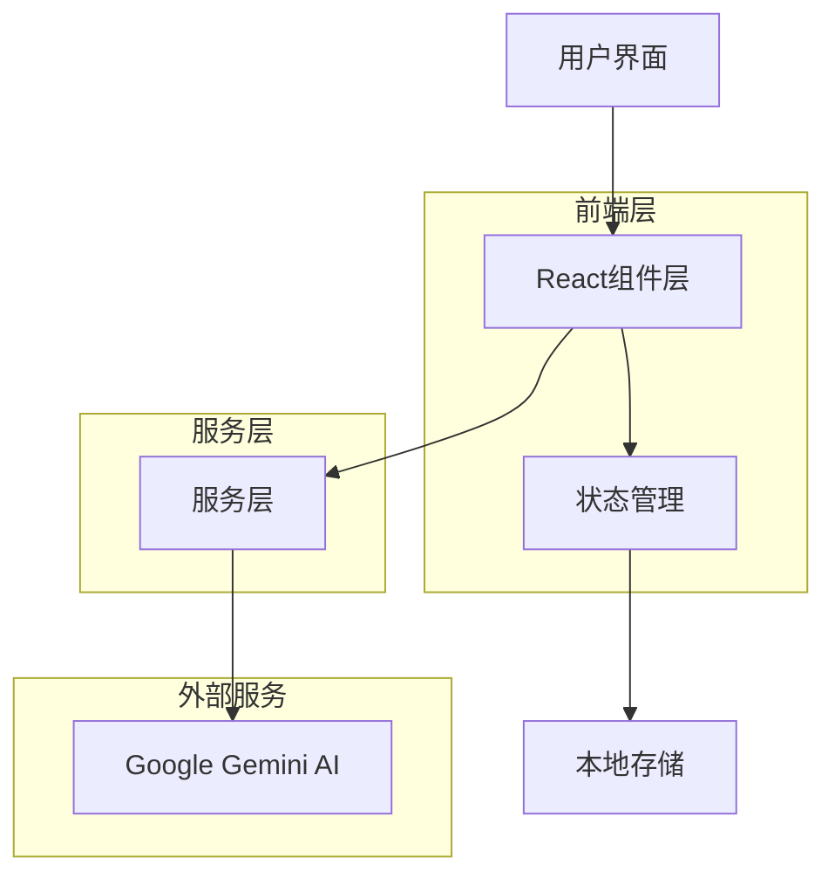

# Vibe Coder AI伙伴 - 项目说明文档

## 1. 项目概述

**Vibe Coder AI伙伴** 是一个创新的AI驱动开发工具，将强大的AI编程助手与个性化的情感响应虚拟伙伴相结合，重新定义了"Vibe Coding"体验。该项目旨在减少等待焦虑，为开发过程增添人性化的触感。

### 核心价值
- **智能编程助手**：基于Google Gemini AI的代码生成和技术支持
- **情感陪伴体验**：可爱的AI伙伴提供情感支持和鼓励
- **高情商回应**：智能生成幽默、机智的社交回应
- **沉浸式体验**：自定义伙伴形象、动态壁纸和背景音乐

## 2. 技术架构

### 2.1 技术栈
- **前端框架**：React 19.1.1 + TypeScript
- **构建工具**：Vite 6.2.0
- **UI组件**：Lucide React图标库
- **AI服务**：Google Gemini AI (@google/genai 1.19.0)
- **状态管理**：React Hooks
- **样式方案**：CSS Modules + 内联样式

### 2.2 项目结构
```
vibe-coder-ai-companion/
├── components/           # React组件
│   ├── ChatPanel.tsx    # 聊天面板
│   ├── CodePreviewPanel.tsx # 代码预览
│   ├── CompanionPanel.tsx   # AI伙伴面板
│   ├── HumorPanel.tsx       # 幽默助手面板
│   ├── SmartReplyPanel.tsx  # 智能回复
│   ├── WorkplacePanel.tsx   # 职场回应
│   ├── DailyQuotePanel.tsx  # 每日语录
│   └── PhraseLibraryPanel.tsx # 话术库
├── services/            # 服务层
│   └── geminiService.ts # AI服务集成
├── hooks/              # 自定义Hooks
│   ├── useCompanionImage.ts # 伙伴图像管理
│   └── useWallpaper.ts     # 壁纸管理
├── types.ts            # TypeScript类型定义
├── demoData.ts         # 演示数据
└── App.tsx             # 主应用组件
```

### 2.3 架构设计


## 3. 核心功能模块

### 3.1 AI编程助手
**文件位置**：`components/ChatPanel.tsx`, `services/geminiService.ts`

**功能特性**：
- 自然语言代码生成
- 实时代码预览
- 技术问题解答
- 项目需求文档生成

**使用方式**：
- 在聊天框中输入开发需求
- AI自动生成完整的HTML代码
- 实时预览生成结果

### 3.2 AI伙伴聊天
**文件位置**：`components/CompanionPanel.tsx`, `services/geminiService.ts`

**功能特性**：
- 情感支持和鼓励
- 非编程问题解答
- 多种情绪状态表达
- 个性化头像设置

**使用方式**：
- 使用 `@AI伙伴` 前缀开始对话
- AI伙伴提供友好的情感回应
- 支持表情符号和活泼语调

### 3.3 智能回应助手
**文件位置**：`components/HumorPanel.tsx`, `components/SmartReplyPanel.tsx`

**功能模块**：

#### 3.3.1 机智接话
- 高情商幽默回应生成
- 多种回应风格（幽默、机智、外交）
- 上下文感知回应

#### 3.3.2 职场回应
- 委婉幽默的职场沟通
- 多场景支持（会议、截止日期、反馈、请求）
- 多语调选择（外交、幽默、专业）

#### 3.3.3 每日语录
- AI生成的机智语录
- 多分类（生活智慧、职场哲理、人际关系等）
- 收藏和分享功能
- 历史记录管理

#### 3.3.4 话术库
- 万能话术快速选择
- 分类管理（赞美型、打圆场、自黑型等）
- 使用频率统计
- 标签过滤和搜索

### 3.4 个性化设置
**文件位置**：`components/SettingsPanel.tsx`

**功能特性**：
- 自定义AI伙伴头像
- 动态壁纸生成
- 背景音乐控制
- 演示模式

## 4. API集成说明

### 4.1 Google Gemini AI集成
**配置文件**：`services/geminiService.ts`

**API密钥配置**：
```typescript
const API_KEY = import.meta.env.VITE_API_KEY;
```

**主要服务方法**：

#### 代码生成
```typescript
export async function generateCode(prompt: string): Promise<CodeGenerationResult>
```

#### AI伙伴聊天
```typescript
export async function chatWithCompanion(prompt: string): Promise<string>
```

#### 智能回复生成
```typescript
export async function generateSmartReply(request: SmartReplyRequest): Promise<SmartReplyResponse>
```

#### 职场回应生成
```typescript
export async function generateWorkplaceReply(request: WorkplaceReplyRequest): Promise<SmartReplyResponse>
```

#### 壁纸生成
```typescript
export async function generateWallpaper(prompt: string): Promise<string>
```

### 4.2 模型配置
- **代码生成模型**：`gemini-2.5-flash`
- **伙伴聊天模型**：`gemini-2.5-flash`
- **壁纸生成模型**：`gemini-2.5-flash-image-preview`
- **幽默助手模型**：`gemini-2.5-flash`

## 5. 安装和使用指南

### 5.1 环境要求
- Node.js (推荐版本 18+)
- npm 或 yarn 包管理器
- Google Gemini API密钥

### 5.2 安装步骤

1. **克隆项目**
```bash
git clone <repository-url>
cd vibe-coder-ai-companion
```

2. **安装依赖**
```bash
npm install
```

3. **配置API密钥**
创建 `.env.local` 文件：
```env
VITE_API_KEY=your_gemini_api_key_here
```

4. **启动开发服务器**
```bash
npm run dev
```

5. **访问应用**
打开浏览器访问 `http://localhost:5173`

### 5.3 构建生产版本
```bash
npm run build
npm run preview
```

## 6. 功能使用指南

### 6.1 代码生成
1. 在左侧聊天面板输入开发需求
2. AI自动生成代码和说明
3. 右侧实时预览生成结果
4. 可切换代码视图和预览视图

### 6.2 AI伙伴聊天
1. 输入 `@AI伙伴` 开始对话
2. 询问非编程相关问题
3. 获得友好的情感支持

### 6.3 智能回应
1. 点击右上角切换到幽默助手面板
2. 选择相应的功能标签
3. 输入需要回应的内容
4. 选择合适的风格和场景
5. 获得AI生成的智能回应

### 6.4 个性化设置
1. 上传自定义AI伙伴头像
2. 生成个性化编程壁纸
3. 控制背景音乐播放

## 7. 数据存储

### 7.1 本地存储
项目使用浏览器的localStorage存储用户数据：

- **每日语录**：`dailyQuote`, `quoteHistory`, `quoteFavorites`
- **话术库**：`phraseUsage`, `phraseFavorites`
- **用户设置**：伙伴头像、壁纸等个性化配置

### 7.2 数据持久化
- 自动保存用户偏好设置
- 历史记录本地缓存
- 收藏内容离线可用

## 8. 部署指南

### 8.1 静态部署
项目构建后生成静态文件，可部署到任何静态托管服务：

- **Vercel**：连接GitHub仓库自动部署
- **Netlify**：拖拽dist文件夹部署
- **GitHub Pages**：配置GitHub Actions自动部署

### 8.2 环境变量配置
部署时需要配置以下环境变量：
```
VITE_API_KEY=your_gemini_api_key
```

### 8.3 构建优化
- 代码分割和懒加载
- 静态资源压缩
- 缓存策略优化

## 9. 开发指南

### 9.1 代码规范
- 使用TypeScript严格模式
- 遵循React Hooks最佳实践
- 组件功能单一职责
- 统一的错误处理机制

### 9.2 扩展开发

#### 添加新的AI功能
1. 在 `services/geminiService.ts` 中添加新的API方法
2. 在 `types.ts` 中定义相关类型
3. 创建对应的React组件
4. 集成到主应用中

#### 添加新的UI组件
1. 在 `components/` 目录创建新组件
2. 遵循现有的设计风格
3. 添加适当的TypeScript类型
4. 实现响应式设计

### 9.3 调试和测试
- 使用浏览器开发者工具
- 检查控制台错误信息
- 验证API调用和响应
- 测试不同设备和浏览器兼容性

## 10. 常见问题

### 10.1 API相关
**Q: API密钥配置错误怎么办？**
A: 检查 `.env.local` 文件中的 `VITE_API_KEY` 是否正确配置，确保密钥有效且有足够的配额。

**Q: AI回应生成失败？**
A: 检查网络连接，确认API密钥权限，查看控制台错误信息。

### 10.2 功能相关
**Q: 背景音乐无法播放？**
A: 浏览器可能阻止自动播放，需要用户手动点击播放按钮。

**Q: 自定义头像不显示？**
A: 检查图片格式是否支持，确认文件大小不超过限制。

### 10.3 部署相关
**Q: 构建失败？**
A: 检查Node.js版本，清除node_modules重新安装依赖。

**Q: 部署后API调用失败？**
A: 确认生产环境的环境变量配置正确。

## 11. 更新日志

### v1.0.0 (当前版本)
- ✅ 基础AI编程助手功能
- ✅ AI伙伴聊天系统
- ✅ 智能回应助手（机智接话、职场回应）
- ✅ 每日语录和话术库
- ✅ 个性化设置（头像、壁纸、音乐）
- ✅ 响应式设计和用户体验优化

### 未来规划
- 🔄 多语言支持
- 🔄 云端数据同步
- 🔄 更多AI模型集成
- 🔄 团队协作功能
- 🔄 插件系统

## 12. 贡献指南

欢迎贡献代码和提出改进建议！

1. Fork项目仓库
2. 创建功能分支
3. 提交代码更改
4. 发起Pull Request

## 13. 许可证

本项目采用MIT许可证，详见LICENSE文件。

---

**联系方式**：如有问题或建议，请通过GitHub Issues联系我们。

**项目地址**：[GitHub Repository](https://github.com/your-username/vibe-coder-ai-companion)
